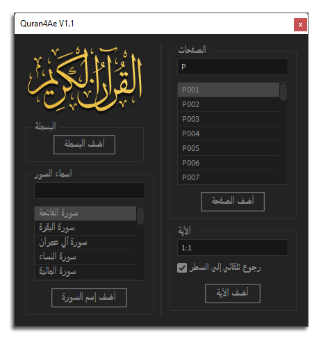

[English](./README-EN.md) | العربية

  
  <h1>مرحبا بكم في مشروع القرآن لبرامج أدوبي</h1>

الحمد لله رب العالمين. والصلاة والسلام على أشرف المرسلين، وعلى آله وصحبه ومن والاه ومن تبعهم بإحسان وإهتدى بهديهم وسار على نهجهم إلى يوم الدين.

قمنا وبحمد الله بإنشاء هذا المشروع المتمثل في أدوات لإدراج النص القرآني بكل سهولة إلى برامج الآدوبي.

## لوحة واجهة مستخدم لبرنامج الأفتر ايفاكت (Quran4Ae)

الأداة عبارة عن لوحة واجهة مستخدم لبرنامج الأفتر ايفاكت تتيح للمستخدمين إضافة الصفحات والآيات وأسماء السور القرآنية بسهولة إلى مشاريعهم مما يوفر الوقت والجهد. 

مقطع تعريفي بالأداة:
https://youtu.be/_I6qtgjFb-Y

مقطع التحديث v1.1:

https://youtu.be/3NAm5xHwSyA

### صورة الأداة

  

